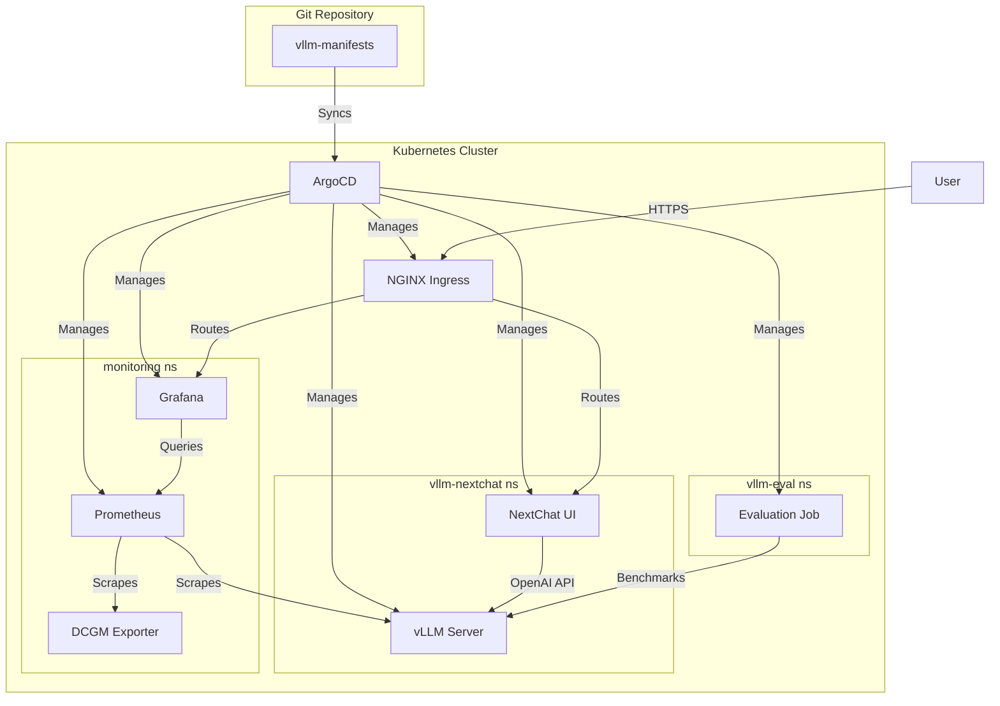

# vLLM Manifests for Kubernetes

본 리포지토리는 vLLM 기반 LLM 추론 서비스를 Kubernetes 클러스터에 효율적으로 배포하고 관리하기 위한 매니페스트 모음입니다. GitOps 철학에 따라 ArgoCD와 함께 사용하는 것을 권장하며, vLLM 서버, 웹 UI, 모니터링, 성능 평가 등 LLM 서비스에 필요한 모든 컴포넌트를 포함하고 있습니다.

## 🚀 주요 기능

-   **통합 LLM 스택**: vLLM 서빙, NextChat UI, GPU 모니터링, 성능 평가 도구를 한 번에 배포.
-   **Helm 기반 배포**: `vllm-nextchat`을 Helm 차트로 제공하여 유연하고 재사용 가능한 설정 관리.
-   **GitOps Ready**: ArgoCD Application 매니페스트를 `argocd-project`에 포함하여 GitOps 워크플로우를 즉시 적용 가능.
-   **Observability**: Prometheus, Grafana, DCGM Exporter를 포함한 강력한 모니터링 스택 기본 제공.
-   **모델 평가**: `vllm-benchmark`, `evalchemy` Job을 통해 배포된 모델의 성능을 체계적으로 측정.

## 📁 디렉토리 구조

```
.
├── argocd-project/       # ArgoCD Application 매니페스트 (GitOps 시작점)
├── docs/                 # 상세 배포 가이드 및 컴포넌트 설명 문서
├── monitoring/           # Prometheus, Grafana 등 모니터링 스택
├── nginx-ingress/        # NGINX Ingress Controller 설정
├── vllm-eval/            # 모델 성능 평가용 Kubernetes Jobs
├── vllm-frontend/        # 추가 프론트엔드 애플리케이션
└── vllm-nextchat/        # vLLM 서버 및 NextChat UI (Helm 차트)
```

## 퀵스타트: ArgoCD로 배포하기

1.  **리포지토리 Fork & Clone**: 이 리포지토리를 Fork한 후 로컬 환경에 Clone합니다.
2.  **`custom-values.yaml` 수정**: `vllm-nextchat/custom-values.yaml` 파일을 열어 배포할 모델, 리소스, 도메인 주소 등 환경에 맞게 수정합니다.
3.  **ArgoCD 연동**:
    -   클러스터에 [ArgoCD를 설치](https://argo-cd.readthedocs.io/en/stable/getting_started/)합니다.
    -   Fork한 Git 리포지토리를 ArgoCD에 [Repository로 등록](https://argo-cd.readthedocs.io/en/stable/user-guide/commands/argocd_repo_add/)합니다.
4.  **App of Apps 배포**: `argocd-project` 디렉토리를 가리키는 ArgoCD Application을 생성하여 모든 컴포넌트를 한 번에 배포합니다.

    ```bash
    # 예시: Root Application 배포
    argocd app create root-app \
      --repo <YOUR_GIT_REPO_URL> \
      --path argocd-project \
      --dest-server https://kubernetes.default.svc \
      --dest-namespace argocd
    ```

## 📚 상세 문서

각 컴포넌트의 상세한 설명과 수동 배포 방법은 `docs` 디렉토리에서 확인할 수 있습니다.

-   [**01 - argocd-project**](./docs/01-argocd-project.md): GitOps Entrypoint
-   [**02 - nginx-ingress**](./docs/02-nginx-ingress.md): 외부 트래픽 관리
-   [**03 - vllm-nextchat**](./docs/03-vllm-nextchat.md): Core LLM Service (Helm)
-   [**04 - vllm-frontend**](./docs/04-vllm-frontend.md): 추가 프론트엔드
-   [**05 - vllm-eval**](./docs/05-vllm-eval.md): 모델 성능 평가
-   [**06 - monitoring**](./docs/06-monitoring.md): 시스템 상태 관찰

## 아키텍처 개요

이 프로젝트는 컴포넌트 기반 아키텍처를 따릅니다. 사용자는 Ingress를 통해 NextChat UI에 접근하고, NextChat은 Kubernetes 내부 서비스를 통해 vLLM 서버와 통신합니다. Prometheus는 vLLM과 노드의 GPU 메트릭을 수집하며, Grafana는 이를 시각화합니다. ArgoCD는 Git 리포지토리의 변경 사항을 지속적으로 클러스터에 동기화하여 전체 시스템의 형상을 관리합니다.



## 기여하기

프로젝트 개선을 위한 기여를 환영합니다. 버그를 발견하거나 새로운 기능을 제안하고 싶다면 언제든지 Issue를 열어주세요. Pull Request는 언제나 환영입니다. 