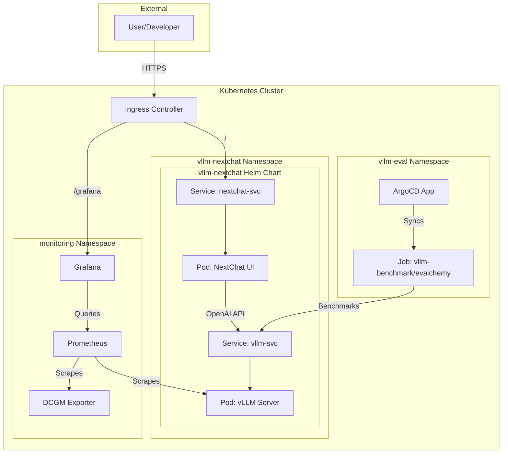

# vLLM-NextChat 서비스 스택 Kubernetes 매니페스트

이 리포지토리는 vLLM 기반의 고성능 LLM 서비스 스택을 Kubernetes 클러스터에 배포하기 위한 모든 매니페스트와 설정을 통합 관리하는 **중앙 저장소(Integration Repository)**입니다.

## 🚀 리포지토리 목표

- **통합 관리**: vLLM, NextChat, 모니터링, 평가 등 여러 컴포넌트의 매니페스트를 한 곳에서 표준화하여 관리합니다.
- **신속한 배포**: 검증된 매니페스트 세트를 통해 전체 서비스 스택을 어떤 Kubernetes 클러스터에도 빠르고 안정적으로 배포할 수 있도록 지원합니다.
- **GitOps 기반 운영**: 모든 인프라 구성을 코드로 관리하여 변경 사항 추적, 버전 관리, 자동 배포를 용이하게 합니다.

## 🏛️ 통합 아키텍처

이 리포지토리에 포함된 컴포넌트들은 다음과 같이 유기적으로 상호작용하여 완전한 LLM 서비스 스택을 구성합니다.



## 📁 컴포넌트별 배포 가이드

각 컴포넌트의 상세한 배포 방법은 `docs/` 디렉토리의 문서를 참고하세요.

- **[vLLM & NextChat 배포 가이드](./docs/vllm-nextchat.md)**: 핵심 LLM 추론 서버와 웹 UI를 배포합니다.
- **[모니터링 스택 배포 가이드](./docs/monitoring.md)**: Prometheus, Grafana 기반의 모니터링 시스템을 배포합니다.
- **[모델 평가 시스템 배포 가이드](./docs/vllm-eval.md)**: 모델 성능을 벤치마킹하는 평가 시스템을 배포합니다.
- **[Ingress 배포 가이드](./docs/ingress.md)**: 외부 트래픽을 내부 서비스로 라우팅하는 Ingress를 설정합니다.

## ✅ 사전 요구사항

- 실행 중인 Kubernetes 클러스터 (v1.24 이상 권장)
- `kubectl` CLI
- `helm` CLI
- 클러스터에 설치된 Ingress Controller (예: Ingress-NGINX)
- NVIDIA GPU 노드 및 [NVIDIA Device Plugin](https://github.com/NVIDIA/k8s-device-plugin)

## ⚙️ 전체 스택 배포 요약

전체 스택을 배포하는 일반적인 순서는 다음과 같습니다. 각 단계의 자세한 내용은 위의 `docs/` 문서를 반드시 확인하세요.

1.  **네임스페이스 생성**: 각 컴포넌트에 대한 네임스페이스를 생성합니다. (예: `vllm-nextchat`, `monitoring`)
    ```bash
    kubectl create namespace vllm-nextchat
    kubectl create namespace monitoring
    ```

2.  **모니터링 스택 배포**:
    ```bash
    # (필요시) grafana-simple.yaml의 비밀번호 수정
    kubectl apply -f monitoring/ -n monitoring
    ```

3.  **vLLM 및 NextChat 배포**:
    ```bash
    # custom-values.yaml 파일 수정
    helm install vllm-app vllm-nextchat/ -f vllm-nextchat/custom-values.yaml -n vllm-nextchat
    ```

4.  **Ingress 설정 배포**:
    ```bash
    # ingress.yaml의 호스트 이름 수정
    kubectl apply -f ingress/
    ```
    
5.  **(선택) 모델 평가 시스템 배포**:
    ```bash
    # GitOps 방식 또는 수동 Job 실행
    kubectl apply -f vllm-eval/vllm-eval-argocd-app.yaml # ArgoCD 사용 시
    ```

## 🌐 서비스 접속

-   **NextChat UI**: `docs/ingress.md` 가이드에 따라 설정한 호스트(예: `http://chat.your-domain.com`)로 접속합니다.
-   **Grafana 대시보드**: 설정된 호스트의 `/grafana` 경로(예: `http://chat.your-domain.com/grafana`)로 접속합니다. 